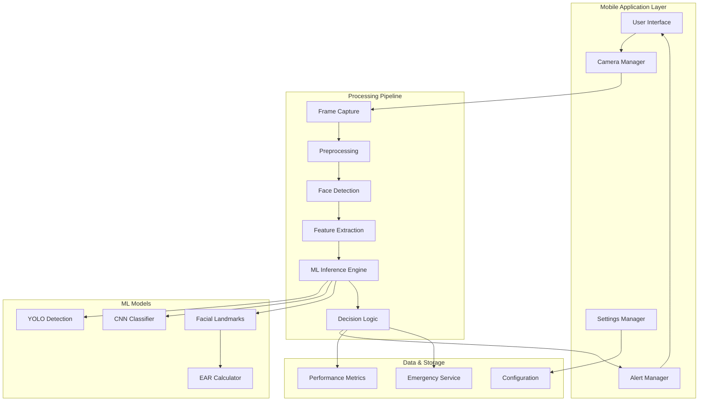

# Design Document: Real-Time Driver Drowsiness Detection System

## Overview

The Real-Time Driver Drowsiness Detection (DDD) system is a comprehensive mobile application that leverages computer vision and machine learning to monitor driver alertness through smartphone cameras. The system combines multiple detection approaches including facial landmark analysis, eye aspect ratio (EAR) calculations, and deep learning models to provide accurate, real-time drowsiness detection with minimal latency.

The architecture prioritizes on-device processing for privacy and real-time performance, utilizing optimized mobile ML frameworks like TensorFlow Lite and ONNX Runtime. The system supports both traditional computer vision approaches (dlib facial landmarks) and modern deep learning methods (YOLO, CNN) to ensure robust detection across diverse conditions.

## Architecture

The system follows a modular, layered architecture designed for real-time performance and cross-platform deployment:



### Key Architectural Principles

1. **Real-time Processing**: Frame processing pipeline optimized for <100ms latency
2. **On-device Inference**: All ML processing occurs locally for privacy and speed
3. **Modular Design**: Pluggable ML models and detection algorithms
4. **Cross-platform Compatibility**: Flutter-based UI with native performance optimizations
5. **Adaptive Performance**: Dynamic model selection based on device capabilities

## Components and Interfaces

### 1. Camera Manager
**Responsibility**: Manages camera access, frame capture, and video stream processing

**Key Methods**:
- `initializeCamera()`: Initialize camera with optimal settings for face detection
- `captureFrame()`: Capture individual frames at target FPS (15-30 FPS)
- `adjustCameraSettings(lightingCondition)`: Adapt camera parameters for lighting conditions

**Performance Requirements**:
- Maintain consistent frame rate of 15+ FPS
- Handle camera permission requests and errors gracefully
- Support both front and rear cameras with preference for front camera

### 2. Face Detection Engine
**Responsibility**: Detect and track facial regions in video frames

**Implementation Options**:
- **Primary**: MediaPipe Face Detection for mobile optimization
- **Secondary**: dlib HOG-based face detector for fallback
- **Tertiary**: YOLO-based face detection for high-accuracy scenarios

**Key Methods**:
- `detectFace(frame)`: Returns bounding box and confidence score
- `trackFace(previousFrame, currentFrame)`: Maintains face tracking across frames
- `validateFaceQuality(faceRegion)`: Ensures face is suitable for drowsiness analysis

### 3. Facial Landmark Detector
**Responsibility**: Extract precise facial feature points for drowsiness analysis

**Implementation**: 
- **Primary**: MediaPipe Face Mesh (468 landmarks) for comprehensive analysis
- **Secondary**: dlib 68-point facial landmark predictor for traditional EAR calculation

**Key Methods**:
- `extractLandmarks(faceRegion)`: Returns normalized landmark coordinates
- `getLandmarkSubset(landmarkType)`: Extract specific features (eyes, mouth, nose)
- `validateLandmarkQuality(landmarks)`: Ensure landmark detection confidence

### 4. Drowsiness Feature Extractors

#### Eye Aspect Ratio (EAR) Calculator
**Formula**: EAR = (|p2-p6| + |p3-p5|) / (2 * |p1-p4|)
Where p1-p6 are eye landmark points

**Key Methods**:
- `calculateEAR(eyeLandmarks)`: Compute EAR for single eye
- `getAverageEAR(leftEye, rightEye)`: Average EAR across both eyes
- `detectBlink(earSequence)`: Identify blink patterns from EAR time series

**Thresholds**:
- Normal EAR: 0.25-0.35
- Drowsy EAR: <0.25 for >2 seconds
- Blink detection: EAR drop >30% for <500ms

#### Mouth Aspect Ratio (MAR) Calculator
**Purpose**: Detect yawning behavior as drowsiness indicator

**Key Methods**:
- `calculateMAR(mouthLandmarks)`: Compute mouth opening ratio
- `detectYawn(marSequence)`: Identify yawning patterns
- `getYawnFrequency(timeWindow)`: Calculate yawn frequency over time period

### 5. ML Inference Engine
**Responsibility**: Coordinate multiple ML models for drowsiness classification

**Supported Models**:
1. **YOLO-based Detection**: Real-time object detection for facial features
2. **CNN Classifier**: End-to-end drowsiness classification from face images
3. **Traditional ML**: SVM/Random Forest using extracted features (EAR, MAR, etc.)

**Key Methods**:
- `loadModel(modelType, modelPath)`: Load and initialize ML models
- `runInference(inputData, modelType)`: Execute model inference
- `ensemblePredict(multipleOutputs)`: Combine predictions from multiple models
- `optimizeForDevice()`: Select optimal model based on device capabilities

**Model Deployment**:
- **Format**: TensorFlow Lite (.tflite) for primary deployment
- **Alternative**: ONNX Runtime for cross-platform compatibility
- **Quantization**: INT8 quantization for mobile optimization
- **Size Constraints**: Models <50MB for app store compliance

### 6. Decision Logic Engine
**Responsibility**: Combine multiple signals to make final drowsiness determination

**Input Signals**:
- EAR values and trends
- MAR values and yawn frequency
- Head pose estimation
- ML model confidence scores
- Historical drowsiness patterns

**Decision Algorithm**:
```
drowsinessScore = (
    earWeight * earScore +
    marWeight * marScore +
    headPoseWeight * headPoseScore +
    mlWeight * mlConfidence
) / totalWeight

if drowsinessScore > highThreshold:
    triggerImmediateAlert()
elif drowsinessScore > mediumThreshold:
    incrementWarningCounter()
    if warningCounter > threshold:
        triggerAlert()
```

**Key Methods**:
- `calculateDrowsinessScore(allInputs)`: Compute weighted drowsiness score
- `updateThresholds(userFeedback)`: Adapt thresholds based on user feedback
- `getConfidenceLevel()`: Return confidence in current drowsiness assessment

### 7. Alert Manager
**Responsibility**: Manage driver notifications and alert escalation

**Alert Types**:
1. **Visual Alerts**: Screen flash, color changes, text warnings
2. **Audio Alerts**: Beeps, voice messages, increasing volume
3. **Haptic Feedback**: Phone vibration patterns
4. **Progressive Escalation**: Gentle → Moderate → Urgent alerts

**Key Methods**:
- `triggerAlert(alertLevel, drowsinessScore)`: Initiate appropriate alert
- `customizeAlerts(userPreferences)`: Configure alert types and sensitivity
- `escalateAlert(currentLevel)`: Increase alert intensity if drowsiness persists
- `logAlertResponse(userAction)`: Track user response for system learning

### 8. Emergency Service Integration
**Responsibility**: Handle severe drowsiness scenarios and emergency response

**Key Methods**:
- `trackLocation()`: Continuous GPS location tracking
- `detectSevereDrowsiness(prolongedDrowsiness)`: Identify emergency scenarios
- `promptUserResponse()`: Request driver confirmation of alertness
- `initiateEmergencyProtocol()`: Contact emergency services if no response
- `sendLocationData(emergencyContact)`: Transmit location and drowsiness data

## Data Models

### Frame Data Structure
```typescript
interface FrameData {
  timestamp: number;
  imageData: Uint8Array;
  width: number;
  height: number;
  format: ImageFormat;
  metadata: FrameMetadata;
}

interface FrameMetadata {
  lightingCondition: LightingLevel;
  cameraOrientation: number;
  exposureTime: number;
  iso: number;
}
```

### Facial Analysis Results
```typescript
interface FacialAnalysisResult {
  faceDetected: boolean;
  faceConfidence: number;
  faceBoundingBox: Rectangle;
  landmarks: FacialLandmarks;
  features: FacialFeatures;
  timestamp: number;
}

interface FacialLandmarks {
  leftEye: Point[];
  rightEye: Point[];
  mouth: Point[];
  nose: Point[];
  jawline: Point[];
  eyebrows: Point[];
}

interface FacialFeatures {
  leftEAR: number;
  rightEAR: number;
  averageEAR: number;
  MAR: number;
  headPose: HeadPose;
  blinkRate: number;
  yawnDetected: boolean;
}
```

### Drowsiness Assessment
```typescript
interface DrowsinessAssessment {
  timestamp: number;
  drowsinessScore: number;
  confidence: number;
  alertLevel: AlertLevel;
  contributingFactors: DrowsinessFactors;
  recommendations: string[];
}

interface DrowsinessFactors {
  earContribution: number;
  marContribution: number;
  headPoseContribution: number;
  mlModelContribution: number;
  historicalPattern: number;
}

enum AlertLevel {
  NONE = 0,
  LOW = 1,
  MEDIUM = 2,
  HIGH = 3,
  CRITICAL = 4
}
```

### User Configuration
```typescript
interface UserConfiguration {
  alertSensitivity: number; // 0.0 - 1.0
  enabledAlertTypes: AlertType[];
  emergencyContacts: EmergencyContact[];
  privacySettings: PrivacySettings;
  modelPreferences: ModelPreferences;
}

interface ModelPreferences {
  preferredModel: ModelType;
  enableGPUAcceleration: boolean;
  maxProcessingLatency: number;
  batteryOptimizationLevel: number;
}
```

## Correctness Properties

*A property is a characteristic or behavior that should hold true across all valid executions of a system—essentially, a formal statement about what the system should do. Properties serve as the bridge between human-readable specifications and machine-verifiable correctness guarantees.*

The following properties define the correctness requirements for the Driver Drowsiness Detection system, derived from the acceptance criteria in the requirements document:

### Performance and Timing Properties

**Property 1: Face Detection Initialization Time**
*For any* mobile device and camera configuration, when the facial analyzer is activated, face detection should complete within 2 seconds for valid face inputs
**Validates: Requirements 1.1**

**Property 2: Real-time Frame Processing Rate**
*For any* system state during active monitoring, the facial analyzer should maintain a processing rate of at least 15 FPS
**Validates: Requirements 1.2**

**Property 3: ML Processing Latency**
*For any* input frame, the ML engine should complete processing within 100 milliseconds to maintain real-time performance
**Validates: Requirements 5.4**

**Property 4: Alert Response Time**
*For any* high-confidence drowsiness detection, the alert manager should trigger an alert within 500 milliseconds
**Validates: Requirements 3.1**

**Property 5: App Initialization Time**
*For any* mobile platform (Android/iOS), the mobile app should complete initialization and camera permission requests within 5 seconds
**Validates: Requirements 4.2**

### Detection Accuracy and Robustness Properties

**Property 6: Facial Feature Tracking Completeness**
*For any* detected face, the facial analyzer should successfully identify and track eyes, mouth, and head position continuously
**Validates: Requirements 1.3**

**Property 7: Lighting Adaptation Accuracy**
*For any* lighting condition change, the facial analyzer should maintain detection accuracy above 90%
**Validates: Requirements 1.4**

**Property 8: Drowsiness Classification Accuracy**
*For any* facial data input with known drowsiness labels, the ML engine should achieve minimum 85% classification accuracy
**Validates: Requirements 2.1, 5.3**

**Property 9: Model Performance Metrics**
*For any* validation dataset, the ML engine should achieve minimum 85% precision and 80% recall
**Validates: Requirements 5.3**

**Property 10: Cross-Platform Robustness**
*For any* lighting condition variation, the system should maintain detection accuracy above 80%
**Validates: Requirements 8.1**

### Specific Detection Capabilities

**Property 11: Microsleep Detection**
*For any* eye closure pattern indicative of microsleep episodes, the ML engine should correctly identify the pattern
**Validates: Requirements 2.2**

**Property 12: Yawn Detection**
*For any* mouth movement sequence, the ML engine should correctly identify yawning behavior as a drowsiness indicator
**Validates: Requirements 2.3**

**Property 13: Head Nodding Recognition**
*For any* head movement pattern, the ML engine should recognize nodding patterns associated with fatigue
**Validates: Requirements 2.4**

**Property 14: Multi-Indicator Confidence Scoring**
*For any* combination of drowsiness indicators, the ML engine should increase confidence scores when multiple indicators are present
**Validates: Requirements 2.5**

### Alert System Properties

**Property 15: Comprehensive Alert Delivery**
*For any* triggered alert, the alert manager should provide both visual and audio alert components
**Validates: Requirements 3.2**

**Property 16: Alert Sensitivity Customization**
*For any* user-configured sensitivity level, the alert manager should adjust alert triggering behavior accordingly
**Validates: Requirements 3.4**

**Property 17: Adaptive Alert Thresholds**
*For any* pattern of frequent false positives, the alert manager should adapt alert thresholds to reduce false alarms
**Validates: Requirements 3.5**

### System Robustness Properties

**Property 18: Face Re-detection After Occlusion**
*For any* face occlusion event, the facial analyzer should attempt re-detection within 3 seconds
**Validates: Requirements 1.5**

**Property 19: Cross-demographic Adaptability**
*For any* driver demographic or facial characteristic variation, the system should maintain consistent detection performance
**Validates: Requirements 8.4**

**Property 20: Head Pose Robustness**
*For any* facial orientation or head position, the system should handle detection across different poses
**Validates: Requirements 8.2**

**Property 21: Environmental Noise Adaptation**
*For any* environmental noise condition affecting audio alerts, the system should increase visual alert prominence
**Validates: Requirements 8.3**

### Mobile Application Properties

**Property 22: Background Operation Continuity**
*For any* app backgrounding event, the mobile app should continue drowsiness monitoring without interruption
**Validates: Requirements 4.5**

**Property 23: Feature Extraction Capability**
*For any* facial feature processing, the ML engine should extract relevant features using HOG or equivalent methods
**Validates: Requirements 5.2**

**Property 24: Model Uncertainty Indication**
*For any* low-confidence model prediction, the ML engine should indicate uncertainty in classification results
**Validates: Requirements 5.5**

**Property 25: One-touch Activation**
*For any* user interaction with the activation control, the mobile app should enable drowsiness monitoring with a single touch
**Validates: Requirements 10.1**

**Property 26: System Status Display**
*For any* system state change, the mobile app should display real-time system status and drowsiness confidence levels
**Validates: Requirements 4.4, 10.4**

**Property 27: User Preference Learning**
*For any* user feedback provided, the mobile app should incorporate preferences into future alert behavior
**Validates: Requirements 10.5**

### Data Privacy and Security Properties

**Property 28: Local Data Processing**
*For any* facial data processing operation, the system should process data locally without cloud transmission
**Validates: Requirements 6.1**

**Property 29: Data Encryption**
*For any* temporarily stored facial data, the system should encrypt the data using industry-standard methods
**Validates: Requirements 6.2**

**Property 30: Automatic Data Deletion**
*For any* completed facial data analysis, the system should automatically delete processed data
**Validates: Requirements 6.3**

**Property 31: User-Requested Data Deletion**
*For any* user request for data deletion, the system should remove all stored personal data
**Validates: Requirements 6.5**

### Emergency Response Properties

**Property 32: GPS Location Tracking**
*For any* emergency feature activation, the emergency service should track vehicle GPS location accurately
**Validates: Requirements 7.1**

**Property 33: Emergency Response Prompting**
*For any* repeated severe drowsiness detection, the emergency service should prompt for driver response
**Validates: Requirements 7.2**

**Property 34: Emergency Escalation Timing**
*For any* driver non-response scenario, the emergency service should prepare emergency contact within 30 seconds
**Validates: Requirements 7.3**

**Property 35: Emergency Data Transmission**
*For any* emergency service contact, the system should provide location and drowsiness severity data
**Validates: Requirements 7.5**

### Performance Monitoring Properties

**Property 36: Performance Degradation Notification**
*For any* system performance degradation, the system should notify the user and suggest recalibration
**Validates: Requirements 8.5**

**Property 37: Alert Customization Capability**
*For any* user preference for alert types and sensitivity, the mobile app should allow customization settings
**Validates: Requirements 10.3**

**Property 38: Accuracy Metrics Logging**
*For any* detection operation, the system should log accuracy metrics for performance analysis
**Validates: Requirements 9.1**

**Property 39: Error Event Recording**
*For any* false positive or negative occurrence, the system should record these events for model improvement
**Validates: Requirements 9.2**

**Property 40: Processing Latency Measurement**
*For any* processing operation, the system should measure and report latency for performance validation
**Validates: Requirements 9.3**

**Property 41: User Feedback Tracking**
*For any* user feedback on alert accuracy and timing, the system should track this feedback
**Validates: Requirements 9.4**

**Property 42: Model Update Flagging**
*For any* performance metric indicating degradation, the system should flag the need for model updates
**Validates: Requirements 9.5**

## Error Handling

The system implements comprehensive error handling across all components to ensure robust operation:

### Camera and Hardware Errors
- **Camera Permission Denied**: Graceful degradation with user guidance to enable permissions
- **Camera Hardware Failure**: Fallback to alternative camera or offline mode with user notification
- **Low Light Conditions**: Automatic camera adjustment and user guidance for optimal positioning
- **Device Orientation Changes**: Automatic adaptation of face detection parameters

### ML Model Errors
- **Model Loading Failures**: Fallback to alternative models or traditional computer vision methods
- **Inference Timeouts**: Skip frame processing and continue with next frame to maintain real-time performance
- **Memory Constraints**: Dynamic model selection based on available device resources
- **Corrupted Model Files**: Model integrity verification and re-download if necessary

### Data Processing Errors
- **Face Detection Failures**: Temporary fallback to previous frame data with re-detection attempts
- **Landmark Extraction Errors**: Quality validation and rejection of low-confidence landmarks
- **Feature Calculation Errors**: Robust mathematical operations with boundary condition handling
- **Classification Uncertainties**: Explicit uncertainty indication and confidence thresholding

### System Integration Errors
- **Background Processing Interruption**: Automatic recovery and state restoration
- **Emergency Service Communication**: Retry mechanisms and offline data storage
- **User Interface Errors**: Error logging and graceful UI recovery
- **Performance Degradation**: Automatic optimization and user notification

## Testing Strategy

The testing approach combines unit testing for specific functionality with property-based testing for comprehensive correctness validation:

### Unit Testing Approach
- **Component Testing**: Individual testing of camera manager, face detection, ML inference, and alert systems
- **Integration Testing**: End-to-end testing of complete drowsiness detection pipeline
- **Edge Case Testing**: Specific scenarios like low light, face occlusion, and device rotation
- **Performance Testing**: Latency measurement and resource usage validation
- **Error Condition Testing**: Systematic testing of all error handling paths

### Property-Based Testing Configuration
- **Testing Framework**: Hypothesis (Python) for ML components, fast-check (TypeScript) for Flutter components
- **Test Iterations**: Minimum 100 iterations per property test to ensure statistical significance
- **Input Generation**: Smart generators that create realistic facial data, lighting conditions, and user interactions
- **Property Validation**: Each correctness property implemented as executable property-based test
- **Test Tagging**: Each property test tagged with format: **Feature: driver-drowsiness-detection, Property {number}: {property_text}**

### Testing Coverage Requirements
- **Functional Coverage**: All acceptance criteria covered by corresponding property tests
- **Performance Coverage**: All timing and accuracy requirements validated through property tests
- **Error Coverage**: All error conditions tested through unit tests and property tests
- **Cross-Platform Coverage**: Testing on both Android and iOS platforms with device variation
- **Demographic Coverage**: Testing across different user demographics and facial characteristics

### Continuous Testing Integration
- **Automated Testing**: All tests run automatically on code changes
- **Performance Benchmarking**: Continuous monitoring of processing latency and accuracy metrics
- **Regression Testing**: Comprehensive test suite prevents performance and accuracy degradation
- **User Feedback Integration**: Real-world usage data incorporated into test case generation